# Employee Management System (HRMS)

A full-featured Human Resource Management System built with **ASP.NET Core MVC**, **C#**, **Entity Framework Core**, and **Microsoft SQL Server**. The platform streamlines core HR operations including employee management, attendance, leave management, payroll, departments, designations, holidays, and audit tracking with secure, role-based access for administrators, HR staff, and employees.


---

## 📌 Overview

HRMS is a centralized web application for managing an organization's workforce. It provides a structured platform for maintaining employee records, departments, designations, attendance, leave requests, payroll, holidays, user accounts, and audit activities within a secure, role-based system.

## ✨ Features

* **Employee Management** — Create, update, view, and manage employee records
* **Attendance Tracking** — Manage Punch In/Punch Out, working hours, attendance status, and automatic absence tracking
* **Leave Management** — Submit, approve, reject, and track employee leave requests
* **Payroll Management** — Manage employee salary information and payroll records
* **Departments & Designations** — Create and manage organizational departments and job designations
* **Holiday Management** — Maintain organizational holidays and holiday records
* **User Management** — Manage application users and employee access
* **Authentication & Authorization** — Secure login with role-based access control (Admin / HR / Employee)
* **Audit Logging** — Track key user actions and system activities for accountability

## 🛠️ Tech Stack

| Layer           | Technology                                       |
| --------------- | ------------------------------------------------ |
| Backend         | ASP.NET Core MVC, C#                             |
| Data Access     | Entity Framework Core, LINQ                      |
| Database        | Microsoft SQL Server                             |
| Frontend        | HTML5, CSS3, JavaScript, Bootstrap               |
| UI              | Razor Views                                      |
| Security        | Authentication, Authorization, Claims, Session   |
| Development     | Visual Studio 2022, SQL Server Management Studio |

## 🏗️ Architecture

The project follows the **MVC (Model-View-Controller)** pattern with a clearly structured application architecture:

```text
HRMS/
├── Controllers/     # Handle HTTP requests and application workflows
├── Models/          # Application entities and data models
├── Views/           # Razor views (UI)
├── Data/            # DbContext and database configuration
├── Services/        # Application and background services
├── Migrations/      # Entity Framework Core database migrations
└── wwwroot/         # Static assets (CSS, JS, images)
```

## 🚀 Getting Started

### Prerequisites

* .NET SDK 8.0+
* SQL Server (or SQL Server Express / LocalDB)
* Visual Studio 2022
* Entity Framework Core CLI

### Installation

1. **Clone the repository**

   ```bash
   git clone https://github.com/sai-tharun-velpula/employee-management-system.git
   cd employee-management-system
   ```

2. **Configure the database connection**

   Update the connection string in `appsettings.json`:

   ```json
   "ConnectionStrings": {
     "DefaultConnection": "Server=YOUR_SERVER;Database=HRMSDb;Trusted_Connection=True;TrustServerCertificate=True;"
   }
   ```

3. **Apply migrations**

   ```bash
   dotnet ef database update
   ```

4. **Run the application**

   ```bash
   dotnet run
   ```

   Then open your browser at the URL shown in the terminal.

## 📸 Screenshots

### 🔐 Login

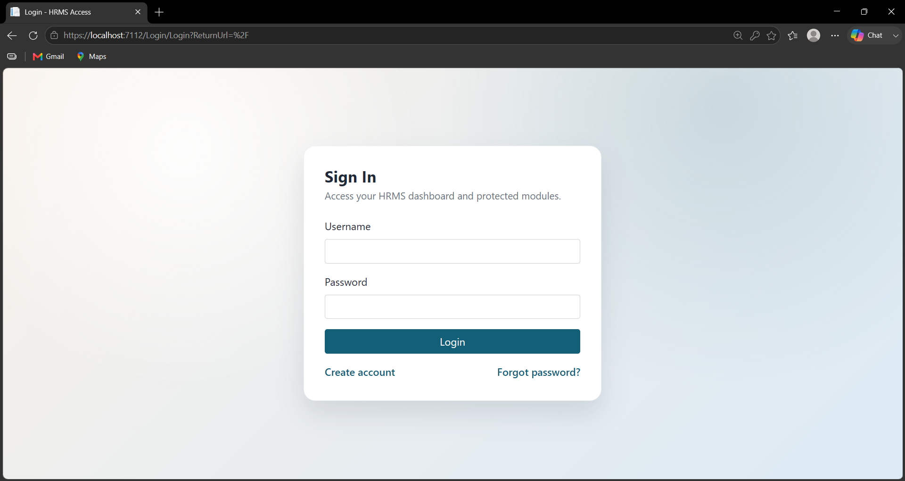

### 👤 Create Account

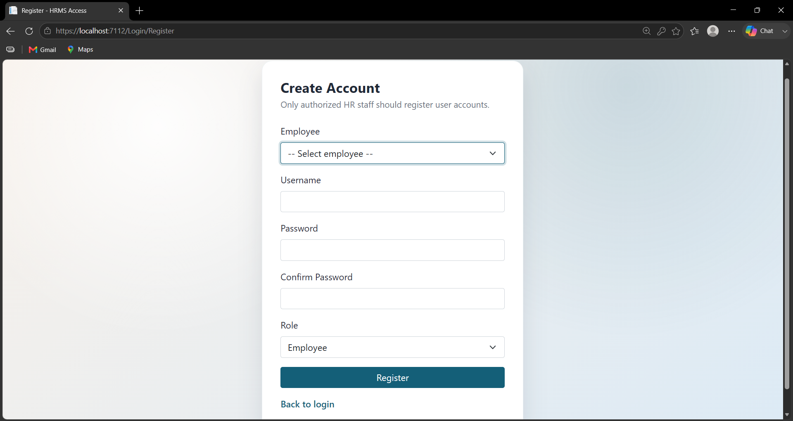

---

## 👨‍💼 Admin

### 📊 Dashboard

<div>
  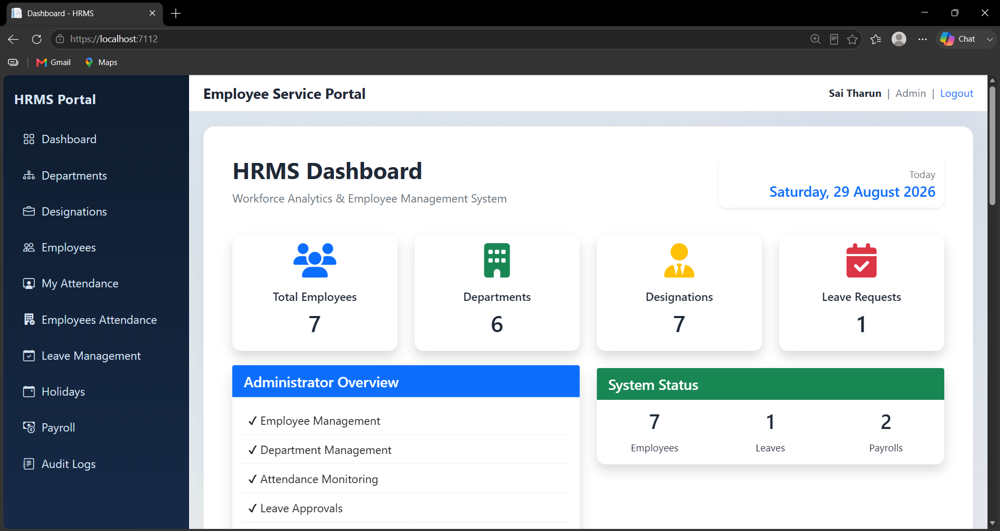
  
  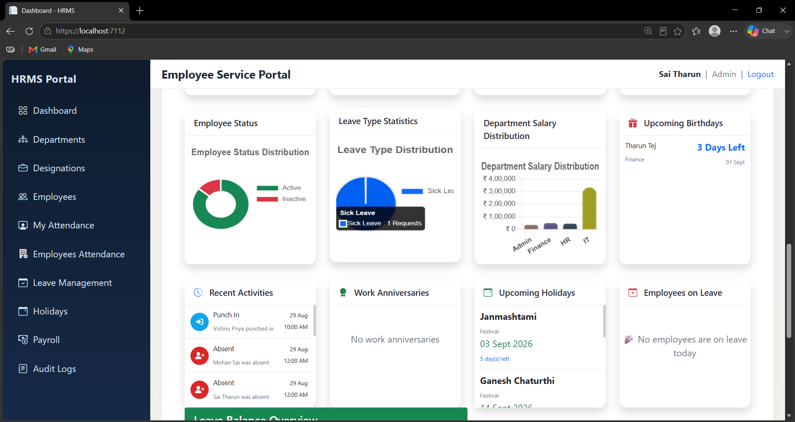
</div>

### 👥 Employee Management

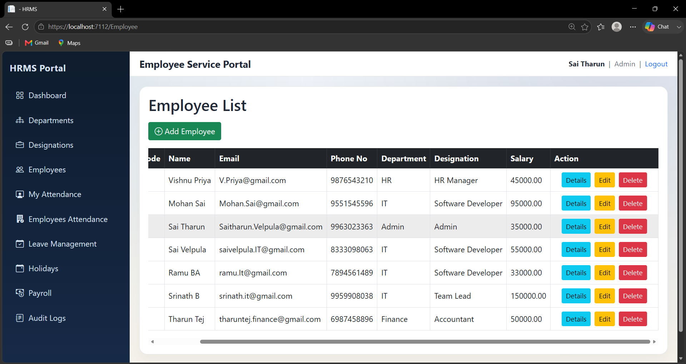

### 🏢 Departments & Designations

<div>
  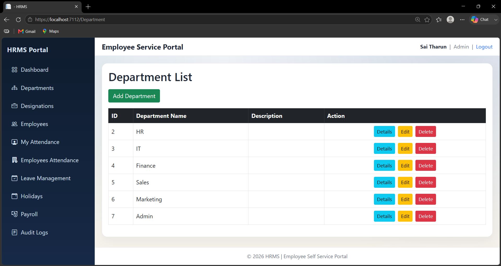
  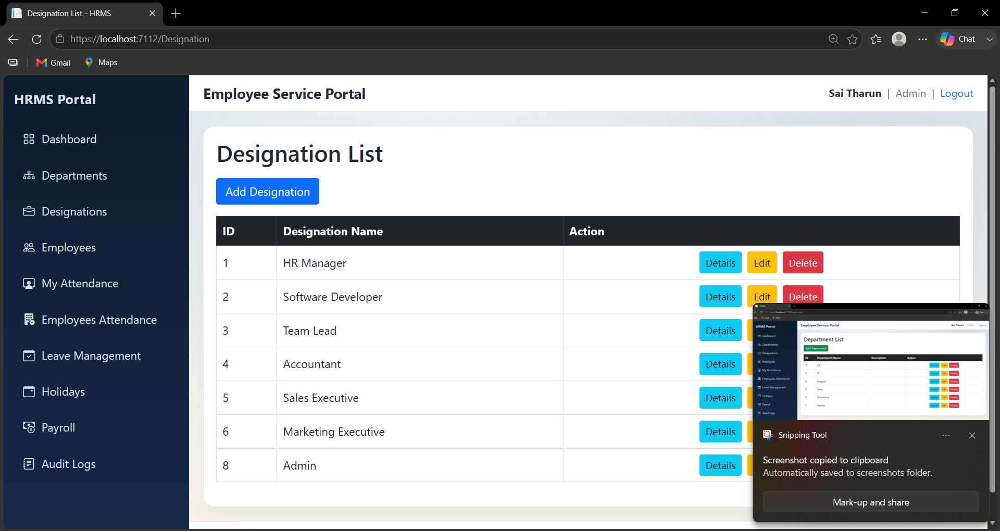
</div>

### 🕐 Attendance

<div>
  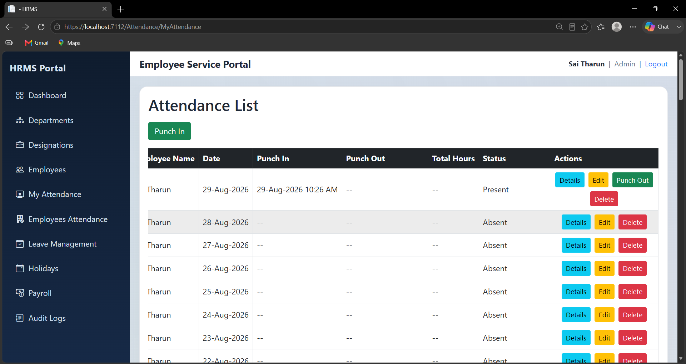
  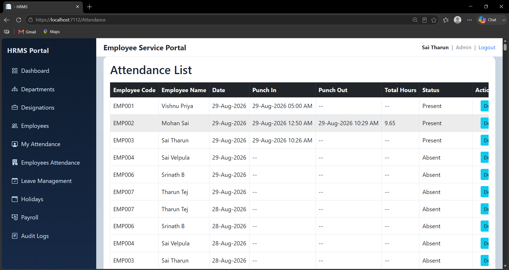
</div>

### 💰 Payroll & Holidays

<div>
  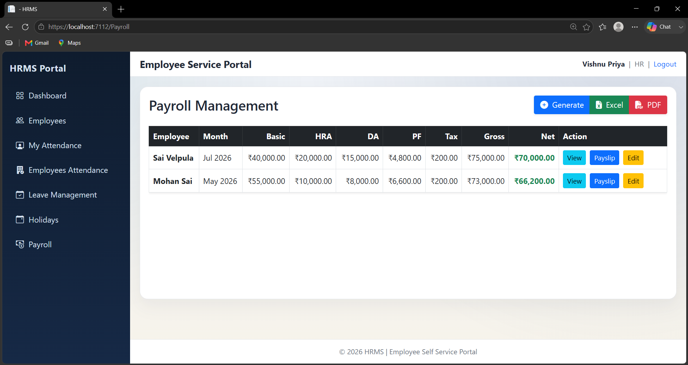
  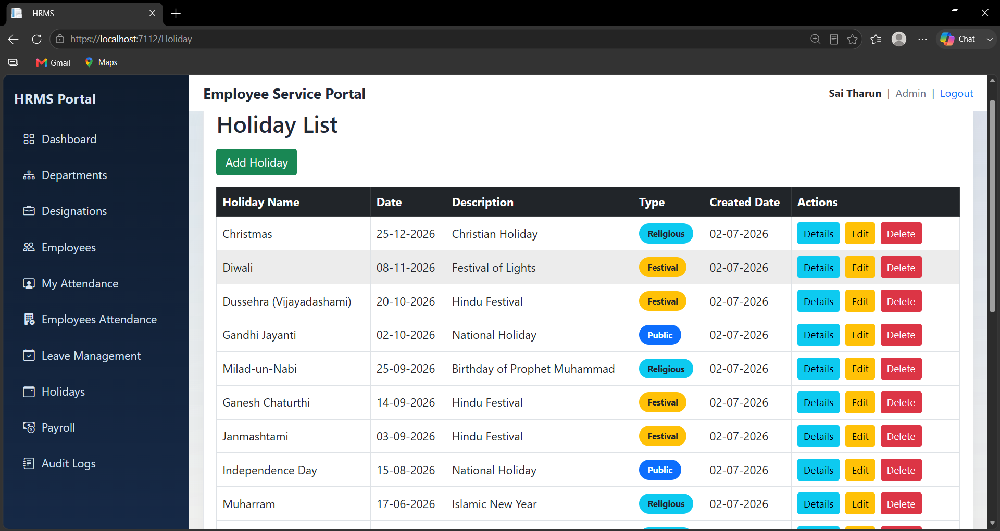
</div>

### 📋 Audit Logs

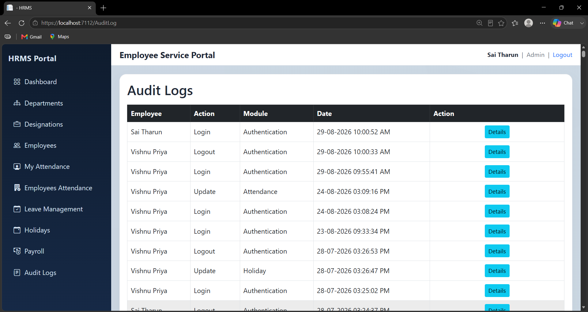

---

## 👩‍💼 HR

### 📊 Dashboard

<div>
  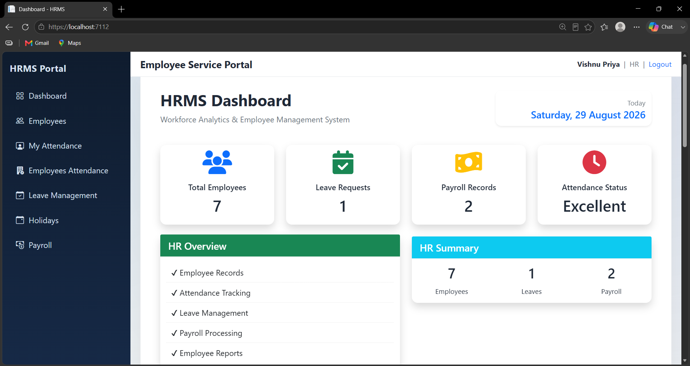
  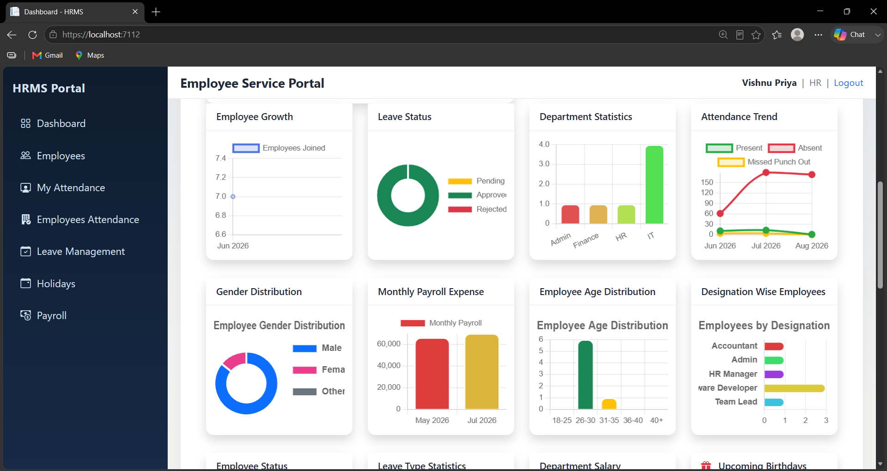
  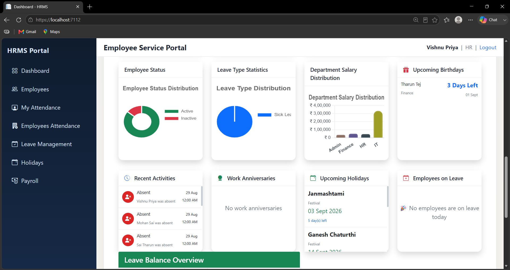
</div>

### 👥 Employee Management

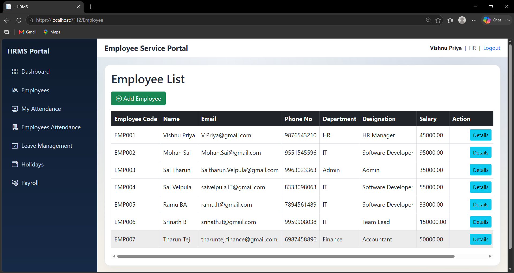

### 🕐 Attendance

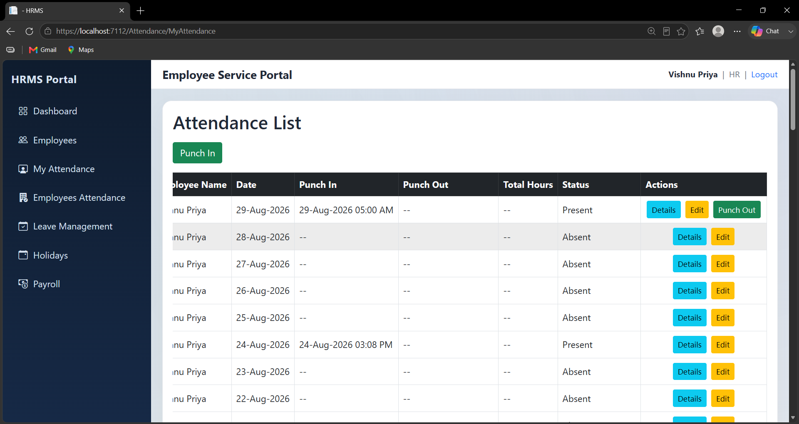

---

## 🧑‍💻 Employee

### 📊 Dashboard

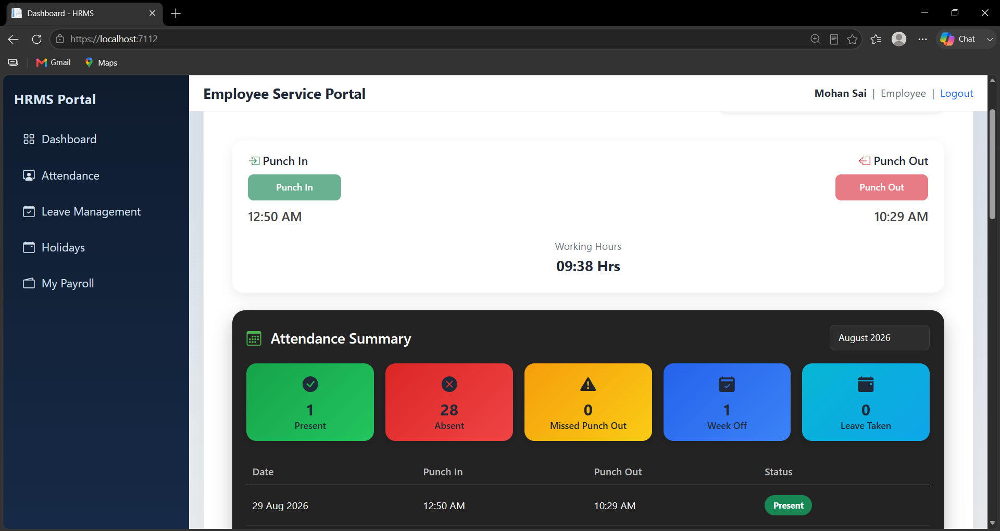

### 📝 Leave Management

<div>
  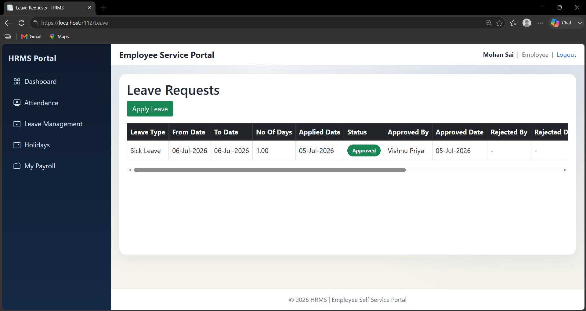
  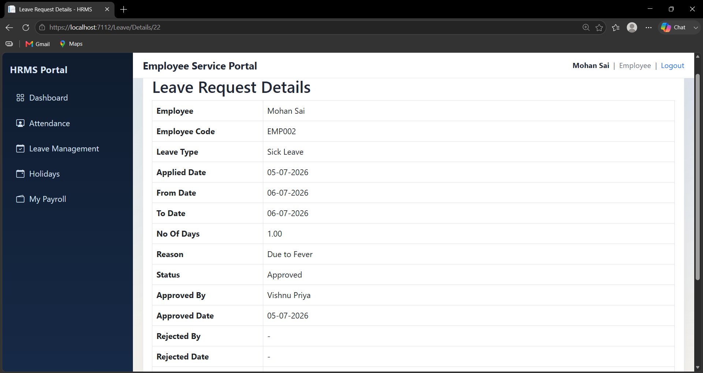
</div>

## 🗺️ Roadmap

* [ ] Add unit and integration tests
* [ ] Enhance employee self-service functionality
* [ ] Add email notifications for leave approvals
* [ ] Add advanced HR reports and analytics
* [ ] Deploy a live demo

## 🤝 Contributing

Contributions, issues, and feature requests are welcome. Please check the [issues page](https://github.com/sai-tharun-velpula/employee-management-system/issues) or open a pull request.

## 📄 License

This project is licensed under the MIT License. See the [LICENSE](LICENSE) file for details.

## 👤 Author

**Sai Tharun Velpula**

GitHub: [@sai-tharun-velpula](https://github.com/sai-tharun-velpula)
